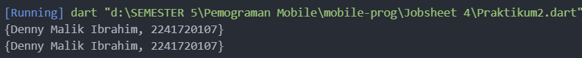

# Pengantar Bahasa Pemrograman Dart - Bagian 3 [collections, records, dan functions]

## Praktikum 1: Eksperimen Tipe Data List

Langkah 1

```dart
var list = [1, 2, 3];
assert(list.length == 3);
assert(list[1] == 2);
print(list.length);
print(list[1]);

list[1] = 1;
assert(list[1] == 1);
print(list[1]);
```


Langkah 2<br>
Silakan coba eksekusi (Run) kode pada langkah 1 tersebut. Apa yang terjadi? Jelaskan!<br>
var list = [1, 2, 3];
Mendefinisikan sebuah list (array) berisi tiga elemen: 1, 2, dan 3.

assert(list.length == 3);
Menggunakan assert untuk memastikan bahwa panjang list sama dengan 3. Jika panjang list tidak 3, akan muncul error. Dalam hal ini, karena list memiliki 3 elemen, perintah ini akan berhasil.

assert(list[1] == 2);
Mengecek apakah elemen pada indeks 1 (elemen kedua) dalam list sama dengan 2. Assert ini juga berhasil karena list[1] memang bernilai 2.

print(list.length);
Mencetak panjang list, yaitu 3, karena list memiliki tiga elemen.

print(list[1]);
Mencetak elemen pada indeks 1 (elemen kedua), yaitu 2.

list[1] = 1;
Mengubah nilai elemen pada indeks 1 dari 2 menjadi 1.

assert(list[1] == 1);
Mengecek apakah elemen pada indeks 1 sekarang bernilai 1. Assert ini juga berhasil karena kita baru saja mengubah nilai elemen tersebut menjadi 1.

print(list[1]);
Mencetak elemen pada indeks 1, yang sekarang adalah 1.

Langkah 3:<br>
Ubah kode pada langkah 1 menjadi variabel final yang mempunyai index = 5 dengan default value = null. Isilah nama dan NIM Anda pada elemen index ke-1 dan ke-2. Lalu print dan capture hasilnya.

Apa yang terjadi ? Jika terjadi error, silakan perbaiki.

Kurang Tipe List<String?> menunjukkan bahwa list ini dapat berisi String atau null.

```dart
final List<String?> list = [null, null, null, null, null];
  list[1] = 'Denny Malik Ibrahim';
  list[2] = "2241720107";

  print(list);
```


## Praktikum 2: Eksperimen Tipe Data Set

Langkah 1:<br>
Deklarasi set<br>
Di sini, halogens adalah sebuah set yang berisi elemen-elemen berupa nama-nama unsur halogen. Set di Dart dideklarasikan menggunakan tanda kurung kurawal {}.
Set adalah koleksi yang tidak mengizinkan elemen yang duplikat, dan urutan elemen tidak terjamin. Ini berarti, jika kamu mencoba menambahkan elemen yang sama lebih dari sekali, hanya satu salinan yang akan disimpan.

Mencetak set<br>
Perintah ini akan mencetak isi dari set halogens ke konsol. Hasilnya adalah daftar semua elemen yang ada dalam set tersebut.

Langkah 3:<br>

```dart
var names1 = <String>{};
Set<String> names2 = {}; // This works, too.
var names3 = {}; // Creates a map, not a set.

print(names1);
print(names2);
print(names3);
```

Apa yang terjadi ? Jika terjadi error, silakan perbaiki namun tetap menggunakan ketiga variabel tersebut.


Tambahkan elemen nama dan NIM Anda pada kedua variabel Set tersebut dengan dua fungsi berbeda yaitu .add() dan .addAll(). Untuk variabel Map dihapus, nanti kita coba di praktikum selanjutnya.

```dart
 var names1 = <String>{};
  Set<String> names2 = {}; // This works, too.
  // var names3 = {}; // Creates a map, not a set.

  names1.add('Denny Malik Ibrahim');
  names1.add('2241720107');

  names2.addAll({'Denny Malik Ibrahim', '2241720107'});

  print(names1);
  print(names2);
```



## Praktikum 3: Eksperimen Tipe Data Map

Langkah 1:<br>

```dart
var gifts = {
  // Key:    Value
  'first': 'partridge',
  'second': 'turtledoves',
  'fifth': 1
};

var nobleGases = {
  2: 'helium',
  10: 'neon',
  18: 2,
};

print(gifts);
print(nobleGases);
```


Langkah 3: <br>

```dart
var mhs1 = Map<String, String>();
gifts['first'] = 'partridge';
gifts['second'] = 'turtledoves';
gifts['fifth'] = 'golden rings';

var mhs2 = Map<int, String>();
nobleGases[2] = 'helium';
nobleGases[10] = 'neon';
nobleGases[18] = 'argon';
```


yang terjadi outputnya sama dengan yang diberikan di langkah 1 dan 2.

Tambahkan elemen nama dan NIM Anda pada tiap variabel di atas (gifts, nobleGases, mhs1, dan mhs2).

```dart
var mhs1 = Map<String, String>();
gifts['first'] = 'partridge';
gifts['second'] = 'turtledoves';
gifts['fifth'] = 'golden rings';

var mhs2 = Map<int, String>();
nobleGases[2] = 'helium';
nobleGases[10] = 'neon';
nobleGases[18] = 'argon';

mhs1.addAll({
  'nama': 'Denny Malik Ibrahim',
  'NIM': '2241720107',
});

mhs2.addAll({
  1:'Denny Malik Ibrahim',
  3:'2241720107',
});

gifts.addAll({
  'nama': 'Denny Malik Ibrahim',
  'NIM': '2241720107',
});

nobleGases.addAll({
  1:'Denny Malik Ibrahim',
  3:'2241720107',
});

print(mhs1);
print(mhs2);

print(gifts);
print(nobleGases);
```


Menambahkan value ke dalam maps dengan fungsi .addAll().

## Praktikum 4: Eksperimen Tipe Data List: Spread dan Control-flow Operators

Langkah 1:<br>

```dart
var list = [1, 2, 3];
var list2 = [0, ...list];
print(list1);
print(list2);
print(list2.length);
```


Error karena tidak ditemukan variabel list1.

Perbaikan (mengganti var list menjadi var list1 atau print(list1) menjadi print(list).


Langkah 3:<br>

```dart
list1 = [1, 2, null];
print(list1);
var list3 = [0, ...?list1];
print(list3.length);
```

Terjadi error.


Perbaikan (dengan mendeklarasikan tipe data dari variabel list1)

```dart
  var list1 = [1, 2, null];
  print(list1);
  var list3 = [0, ...?list1];
  print(list3.length);
```

Tetapi

Operator ...? (null-aware spread operator) untuk mencegah penyebaran objek null, tetapi hanya pada keseluruhan list yang null. Jika ada elemen null di dalam list, itu tidak akan ditangani oleh operator tersebut, sehingga tetap terjadi error.
Jadi bisa dengan mengganti elemen null dengan nilai yang valid, atau memfilter nilai null sebelum menyebarkannya.

```dart
  var list1 = [1, 2, null];
  print(list1);
  var list3 = [0, ...list1.where((element) => element != null)];
  print(list3.length);
```


Langkah 4:<br>

```dart
var nav = ['Home', 'Furniture', 'Plants', if (promoActive) 'Outlet'];
print(nav);
```

Perbaikan

```dart
bool promoActive = true;
  var nav = ['Home', 'Furniture', 'Plants', if (promoActive) 'Outlet'];
  print(nav);

  promoActive = false;
  nav = ['Home', 'Furniture', 'Plants', if (promoActive) 'Outlet'];
  print(nav);
```


Langkah 5:<br>

```dart
var nav2 = ['Home', 'Furniture', 'Plants', if (login case 'Manager') 'Inventory'];
print(nav2);
```

Perbaikan

```dart
String login = 'Manager';
var nav2 = ['Home', 'Furniture', 'Plants', if (login case 'Manager') 'Inventory'];
print(nav2);

login = 'Employee';
nav2 = ['Home', 'Furniture', 'Plants', if (login case 'Manager') 'Inventory'];
print(nav2);
```


Langkah 6:<br>

```dart
var listOfInts = [1, 2, 3];
var listOfStrings = ['#0', for (var i in listOfInts) '#$i'];
assert(listOfStrings[1] == '#1');
print(listOfStrings);
```


Collection for dalam Dart = fitur yang memungkinkan kita menggunakan loop for di dalam koleksi seperti list, set, atau map. Ini membuat penulisan kode lebih ringkas dan lebih mudah dibaca ketika kita ingin menghasilkan collection berdasarkan logika tertentu.

## Praktikum 5: Eksperimen Tipe Data Records

Langkah 1:<br>

```dart
var record = ('first', a: 2, b: true, 'last');
print(record)
```

perbaikan (menambahkan tanda titik koma setelah record)

```dart
var record = ('first', a: 2, b: true, 'last');
print(record);
```


Langkah 3:<br>

```dart
(int, int) tukar((int, int) record) {
  var (a, b) = record;
  return (b, a);
}
```

tidak ada output. Untuk menggunakan fungsi tukar() harus dipanggil di dalam main().

```dart
var record2 = (1, 2);
var record3 = tukar(record2);
print(record3);
```


Langkah 4:<br>

```dart
// Record type annotation in a variable declaration:
(String, int) mahasiswa;
print(mahasiswa);
```

Inisialisasi field nama dan NIM Anda pada variabel record mahasiswa di atas.


Terjadi error karena variabel mahasiswa sebelumnya tidak memiliki value

Perbaikan<br>

```dart
// Record type annotation in a variable declaration:
(String, int) mahasiswa;
mahasiswa = ('Muhammad Naufal Haidar Setyawan', 2241720097);
print(mahasiswa);
```


Langkah 5:<br>

```dart
var mahasiswa2 = ('first', a: 2, b: true, 'last');

print(mahasiswa2.$1); // Prints 'first'
print(mahasiswa2.a); // Prints 2
print(mahasiswa2.b); // Prints true
print(mahasiswa2.$2); // Prints 'last'
```


Gantilah salah satu isi record dengan nama dan NIM Anda

```dart
  var mahasiswa2 = ('first', a: "Denny Malik Ibrahim", b: 2241720107, 'last');

  print(mahasiswa2.$1); // Prints 'first'
  print(mahasiswa2.a); // Prints 2
  print(mahasiswa2.b); // Prints true
  print(mahasiswa2.$2); // Prints 'last'
```


## Tugas Praktikum

1.  Jelaskan yang dimaksud Functions dalam bahasa Dart!<br>
    Functions adalah blok kode yang dapat dipanggil untuk menjalankan serangkaian instruksi. Mereka digunakan untuk membagi program menjadi bagian-bagian yang lebih kecil dan terorganisir, membuat kode lebih mudah dibaca, dipelihara, dan digunakan kembali.<br>

        Contoh

        ```dart
        void myFunction() {
            // kode di sini
            }
        ```

2.  Jelaskan jenis-jenis parameter di Functions beserta contoh sintaksnya!<br> 

- Parameter Posisi (Positional Parameters)
    Parameter ini harus diisi dalam urutan yang telah ditentukan saat memanggil fungsi.

```dart
void greet(String name) {
  print('Hello, $name!');
}
```
- Parameter Opsional (Optional Parameters)
Parameter ini dapat ditentukan dengan tanda kurung siku [], dan bisa diisi atau tidak saat memanggil fungsi.

```dart
void greet(String name, [int age]) {
  print('Hello, $name!' + (age != null ? ' You are $age years old.' : ''));
}

void main() {
  greet('Denny'); // Memanggil tanpa parameter opsional
  greet('Denny', 22); // Memanggil dengan parameter opsional
}
```

- Parameter Named (Named Parameters)
Parameter ini ditandai dengan menggunakan kurung kurawal {}. Ini memberikan fleksibilitas untuk mengisi parameter dalam urutan yang berbeda.

```dart
void greet({required String name, int? age}) {
  print('Hello, $name!' + (age != null ? ' You are $age years old.' : ''));
}

void main() {
  greet(name: 'Denny'); // Memanggil dengan parameter named
  greet(name: 'Denny', age: 22); // Memanggil dengan parameter named dan opsional
}
```

- Parameter Default (Default Parameter)
Parameter ini memiliki nilai default yang digunakan jika tidak diberikan nilai saat pemanggilan.

```dart
void greet(String name, [int age = 18]) {
  print('Hello, $name! You are $age years old.');
}

void main() {
  greet('Denny'); // Akan menggunakan nilai default 18
  greet('Denny', 22); // Menggunakan nilai 22
}
```

3.  Jelaskan maksud Functions sebagai first-class objects beserta contoh sintaknya!<br>
functions sebagai first-class objects berarti bahwa fungsi dapat diperlakukan seperti objek biasa. Dapat melakukan beberapa hal dengan fungsi yang sama seperti yang bisa kamu lakukan dengan objek lainnya, seperti:

- Menyimpan fungsi dalam variabel.
```dart
void sayHello() {
  print('Hello, World!');
}

void main() {
  var greeting = sayHello; // Menyimpan fungsi dalam variabel
  greeting(); // Memanggil fungsi melalui variabel
}
```

- Mengirim fungsi sebagai argumen ke fungsi lain.
```dart
void executeFunction(Function func) {
  func(); // Memanggil fungsi yang diterima sebagai argumen
}

void sayHello() {
  print('Hello, World!');
}

void main() {
  executeFunction(sayHello); // Mengirim fungsi sayHello sebagai argumen
}
```


- Mengembalikan fungsi dari fungsi lain.
```dart
Function createGreeting(String greeting) {
  return () {
    print(greeting);
  }; // Mengembalikan fungsi anonim
}

void main() {
  var greetHello = createGreeting('Hello, World!');
  greetHello(); // Memanggil fungsi yang dikembalikan
}
```

4.  Apa itu Anonymous Functions? Jelaskan dan berikan contohnya!<br>
Anonymous functions (atau fungsi anonim) adalah fungsi yang tidak memiliki nama. Fungsi ini sering digunakan ketika perlu mendefinisikan fungsi dengan cepat dan tidak perlu menyimpannya untuk digunakan di tempat lain. Anonymous functions biasanya digunakan sebagai callback atau untuk fungsi-fungsi yang hanya diperlukan sekali.

Contoh 
- Menyimpan Anonymous Function dalam Variabel: Kamu dapat menyimpan fungsi anonim dalam variabel dan memanggilnya kemudian.
```dart
void main() {
  var greet = () {
    print('Hello, World!');
  };
  
  greet(); // Memanggil fungsi anonim
}
```

- Menggunakan Anonymous Function sebagai Callback: Anonymous functions sering digunakan dalam callback, misalnya dalam metode forEach dari list.
```dart
void main() {
  var numbers = [1, 2, 3, 4, 5];

  numbers.forEach((number) {
    print('Number: $number');
  });
}
```

- Mengembalikan Anonymous Function dari Fungsi Lain: Fungsi anonim juga bisa dikembalikan dari fungsi lain.
```dart
Function createMultiplier(int multiplier) {
  return (int value) {
    return value * multiplier; // Fungsi anonim yang mengalikan
  };
}

void main() {
  var double = createMultiplier(2);
  print(double(5)); // Output: 10
}
```

5.  Jelaskan perbedaan Lexical scope dan Lexical closures! Berikan contohnya!<br>
Lexical Scope dan Lexical Closures adalah dua konsep penting dalam pemrograman yang terkait dengan cara variabel dan fungsi berinteraksi.

- Lexical Scope (atau static scope) merujuk pada cara variabel diakses berdasarkan lokasi kode tempat variabel tersebut dideklarasikan. Dengan kata lain, akses ke variabel ditentukan oleh struktur blok kode (misalnya, fungsi, loop, atau blok bersarang) di mana variabel tersebut dideklarasikan.

```dart
void main() {
  var outerVariable = 'Hello';

  void innerFunction() {
    print(outerVariable); // Mengakses outerVariable dari scope luar
  }

  innerFunction(); // Output: Hello
}
```

- Lexical Closures adalah fungsi yang "menangkap" dan menyimpan referensi ke variabel dari scope di mana fungsi tersebut dideklarasikan, meskipun fungsi tersebut dipanggil di luar scope tersebut. Ini berarti bahwa fungsi dapat mengingat dan mengakses variabel yang dideklarasikan di luar fungsinya, bahkan setelah scope tersebut selesai.

```dart
void main() {
  var counter = 0;

  Function incrementCounter() {
    return () {
      counter++; // Menangkap dan mengubah counter
      print(counter);
    };
  }

  var increment = incrementCounter(); // Mendapatkan fungsi penambah
  increment(); // Output: 1
  increment(); // Output: 2
}
```

6.  Jelaskan dengan contoh cara membuat return multiple value di Functions!<br>
dapat mengembalikan beberapa nilai dari sebuah fungsi dengan menggunakan beberapa cara, seperti mengembalikan objek, menggunakan tuple, atau menggunakan Map.

- Mengembalikan Objek

```dart
class Person {
  String name;
  int age;

  Person(this.name, this.age);
}

Person getPerson() {
  return Person('Denny Malik Ibrahim', 22);
}

void main() {
  Person person = getPerson();
  print('Name: ${person.name}, Age: ${person.age}'); // Output: Name: Denny Malik Ibrahim, Age: 22
}
```

- Menggunakan Tuple

```dart
import 'package:tuple/tuple.dart';

Tuple2<String, int> getPerson() {
  return Tuple2('Denny Malik Ibrahim', 22);
}

void main() {
  var person = getPerson();
  print('Name: ${person.item1}, Age: ${person.item2}'); // Output: Name: Denny Malik Ibrahim, Age: 22
}
```

- Menggunakan Map

```dart
Map<String, dynamic> getPerson() {
  return {
    'name': 'Denny Malik Ibrahim',
    'age': 22,
  };
}

void main() {
  var person = getPerson();
  print('Name: ${person['name']}, Age: ${person['age']}'); // Output: Name: Denny Malik Ibrahim, Age: 22
}
```

- Menggunakan List

```dart
List<dynamic> getPerson() {
  return ['Denny Malik Ibrahim', 22];
}

void main() {
  var person = getPerson();
  print('Name: ${person[0]}, Age: ${person[1]}'); // Output: Name: Denny Malik Ibrahim, Age: 22
}
```
