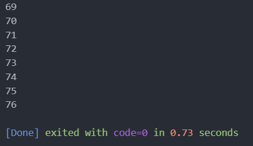
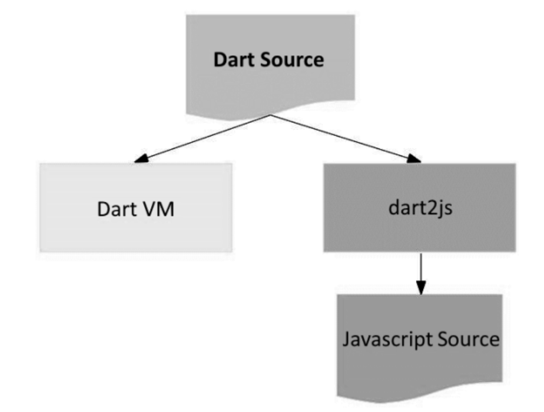

# TUGAS PRAKTIKUM MOBILE 1
## Nama : Denny Malik Ibrahim


1. 
```dart
    void main() {
    for (int i = 18; i > 8; i--) {
        print('Nama saya adalah Fulan, sekarang berumur ${i}');
    }
    }
```

output:


2. Mengapa sangat penting untuk memahami bahasa pemrograman Dart sebelum kita menggunakan framework Flutter ? Jelaskan!
- dasar dari framework flutter. Semua kode yang tulis di Flutter, termasuk UI, logika aplikasi, dan pengelolaan state, ditulis menggunakan Dart

3. Rangkumlah materi dari codelab ini menjadi poin-poin penting yang dapat Anda gunakan untuk membantu proses pengembangan aplikasi mobile menggunakan framework Flutter!
- tujuan Dart menggabungkan kelebihan-kelebihan dari sebagian besar bahasa tingkat tinggi dengan fitur-fitur bahasa pemrograman terkini
- cara mengeksekusi kode Dart. dengan dua cara
Dart virtual machines (VMs)
JavaScript compilations



- Lingkungan yang mendukung bahasa Dart:
Runtime systems
Dart core libraries
Garbage collectors

- Eksekusi kode Dart dapat beroperasi dalam dua mode — kompilasi Just-In-Time (JIT) atau Kompilasi Ahead-Of-Time (AOT).

    Kompilasi JIT adalah tempat kode sumber dikompilasi sesuai kebutuhan—Just in time. Dart VM memuat dan mengkompilasi kode sumber ke kode mesin asli (native). Pendekatan ini digunakan untuk menjalankan kode pada command line atau selama proses pengembangan aplikasi mobile yang dapat memanfaatkan fitur seperti debugging dan hot reload.

    Kompilasi AOT adalah dimana Dart VM dan kode Anda dikompilasi sebelumnya, VM bekerja lebih seperti sistem runtime Dart, yang menyediakan garbage collector dan metode-metode native dari Dart software development kit (SDK) pada aplikasi. Pendekatan ini memiliki keuntungan performa yang sangat besar dibandingkan kompilasi JIT, tetapi fitur lain seperti debugging dan hot reload tidak tersedia.

- Hot reload

    Dart banyak berkontribusi pada fitur Flutter yang paling terkenal, yaitu hot reload, yang didasarkan pada kompiler Dart JIT. Hal Ini memungkinkan pengembang untuk mendapatkan umpan balik yang sangat cepat terhadap perubahan kode yang dilakukan, sehingga memungkinkan untuk beralih lebih cepat. Dapat mendukung pengembangan perangkat lunak yang lebih cepat dan berkualitas tinggi.

- Structure of the Dart language
Dart, seperti banyak bahasa modern, menggunakan paradigma object-oriented (OO). OOP berfokus pada objek yang menyimpan data (fields) dan kode (methods). Objek ini dibuat dari cetak biru yang disebut class, yang menentukan fields dan methods untuk setiap objek.

4. Buatlah slide yang berisi penjelasan dan contoh eksekusi kode tentang perbedaan Null Safety dan Late variabel!

- Null Safety

    Null Safety adalah fitur yang memastikan variabel tidak boleh bernilai null, kecuali secara eksplisit diizinkan.
    Mencegah runtime error yang disebabkan oleh dereference nilai null.
    Digunakan untuk meningkatkan keamanan dan stabilitas aplikasi.

    Contoh kode:
    ```dart
    void main() {
  String? nullableString; // Nullable, bisa null
  String nonNullableString = "Hello"; // Non-nullable, tidak bisa null

  nullableString = null; // OK
  nonNullableString = null; // Error: Non-nullable variable cannot be null
  }


- Late Variable

    late adalah keyword yang digunakan untuk menunda inisialisasi variabel.
    Memungkinkan variabel non-nullable untuk diinisialisasi setelah deklarasi.
    Berguna ketika inisialisasi variabel memerlukan data yang belum tersedia pada saat deklarasi.

    Contoh kode
    ```dart
        void main() {
        late String lateString;

        // Do some operations

        lateString = "Initialized later"; // Variabel diinisialisasi di sini
        print(lateString); // Output: Initialized later
        }

- Perbedaan utama

    Null Safety: Mencegah variabel memiliki nilai null kecuali diizinkan.<br>
    Late Variable: Menunda inisialisasi variabel sampai nanti, tetapi tetap menjaga agar variabel tersebut non-nullable.

- Studi kasus

    Null Safety: Berguna untuk menghindari bug dalam aplikasi yang disebabkan oleh nilai null yang tidak diharapkan.<br>
    Late Variable: Cocok untuk skenario di mana nilai variabel tergantung pada operasi atau data yang tidak tersedia saat deklarasi.

    Contoh kode:

    ```dart
        void main() {
    late String userName;
    String? userRole;

    userRole = null; // Null safety memungkinkan ini

    userName = "John Doe"; // Late digunakan untuk menunda inisialisasi
    print("User: $userName, Role: ${userRole ?? 'Guest'}"); 
    }

- Kesimpulan

    Null Safety dan late variable adalah fitur penting dalam Dart yang membantu menulis kode yang lebih aman dan efektif.<br>
    Null Safety menghindari kesalahan null, sementara late variable memberikan fleksibilitas dalam inisialisasi variabel.

