# Praktikum 1: Mengunduh Data dari Web Service (API)

Langkah 1: Buat Project Baru
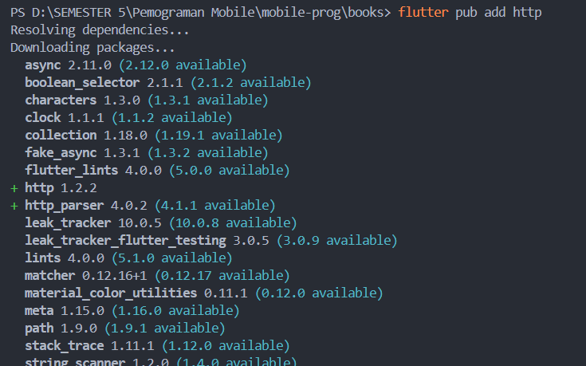

Langkah 2: Cek file pubspec.yaml
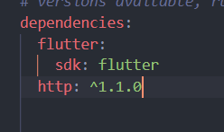

Langkah 3: Buka file main.dart
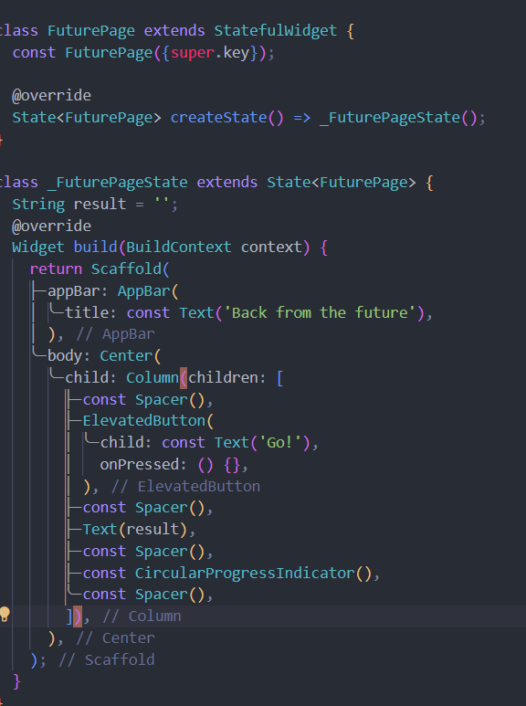

Langkah 4: Tambah method getData()
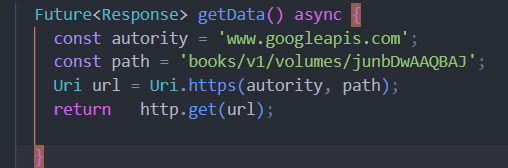
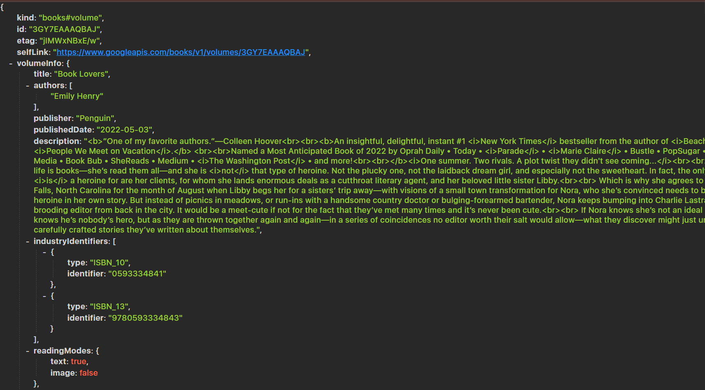

Langkah 5: Tambah kode di ElevatedButton
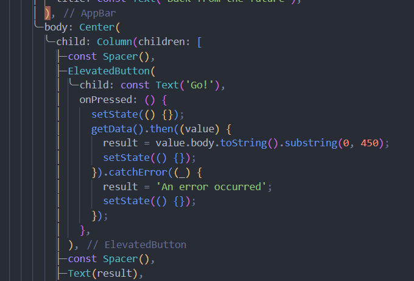

Jelaskan maksud kode langkah 5 tersebut terkait substring dan catchError!
substring:
Di dalam callback then dari getData, nilai yang dikembalikan oleh getData() (yang diasumsikan sebagai value) akan diproses. Pada value.body.toString().substring(0, 450), bagian substring(0, 450) mengambil hanya 450 karakter pertama dari value.body. Ini dilakukan agar data yang panjang hanya menampilkan bagian awalnya. Dengan demikian, jika value.body berisi teks yang sangat panjang, hanya bagian awal yang akan disimpan dalam result untuk tampilan atau keperluan lainnya.

catchError:
catchError digunakan untuk menangani error jika proses getData() gagal, misalnya karena masalah jaringan atau kesalahan server. Jika error terjadi, catchError akan mengatur result menjadi 'An error occurred' dan memanggil setState(() {}) untuk memperbarui tampilan. Dengan ini, pengguna akan melihat pesan kesalahan alih-alih aplikasi diam atau mengalami error yang tidak tertangani.

# Praktikum 2: Menggunakan await/async untuk menghindari callbacks

Langkah 1: Buka file main.dart
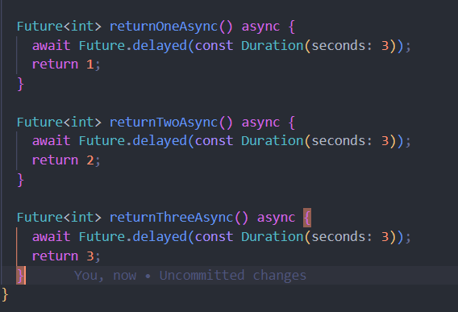

Langkah 2: Tambah method count()
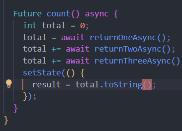

Langkah 3: Panggil count()

Langkah 4: Run

Jelaskan maksud kode langkah 1 dan 2 tersebut!
Langkah 1: Fungsi Asinkron returnOneAsync, returnTwoAsync, dan returnThreeAsync
Pada langkah ini, terdapat tiga fungsi asinkron yang mengembalikan nilai integer setelah jeda waktu 3 detik:

returnOneAsync: Fungsi ini menunggu (await) selama 3 detik (dengan Future.delayed(Duration(seconds: 3))), kemudian mengembalikan nilai 1.
returnTwoAsync: Sama seperti returnOneAsync, namun fungsi ini mengembalikan nilai 2 setelah jeda 3 detik.
returnThreeAsync: Fungsi ini juga menunggu 3 detik, kemudian mengembalikan nilai 3.
Ketiga fungsi ini menunjukkan bagaimana fungsi asinkron dapat dijeda sebelum mengembalikan hasil. Ini berguna dalam simulasi pemrosesan atau permintaan jaringan yang membutuhkan waktu sebelum mendapatkan respons.

Langkah 2: Fungsi Asinkron count
Fungsi count bertugas untuk menjalankan ketiga fungsi di Langkah 1 secara berurutan dan menjumlahkan hasilnya. Berikut langkah-langkah dalam fungsi ini:

Inisialisasi Total: Variabel total diinisialisasi ke 0 untuk menyimpan hasil penjumlahan nilai yang dikembalikan oleh fungsi di Langkah 1.

Panggilan dan Penjumlahan Asinkron:

total = await returnOneAsync();: Memanggil returnOneAsync dan menyimpan hasilnya (1) dalam total.
total += await returnTwoAsync();: Memanggil returnTwoAsync dan menambahkan hasilnya (2) ke total, sehingga total sekarang menjadi 3.
total += await returnThreeAsync();: Memanggil returnThreeAsync dan menambahkan hasilnya (3) ke total, sehingga total akhirnya menjadi 6.
Memperbarui State: Setelah ketiga fungsi selesai dijalankan dan total dihitung, setState dipanggil untuk memperbarui variabel result dengan nilai total yang sudah dijadikan string (total.toString()), yang kemudian bisa ditampilkan di UI.

Secara keseluruhan, count menghitung jumlah total dari hasil tiga fungsi asinkron, menunggu setiap fungsi selesai sebelum melanjutkan ke fungsi berikutnya. Total penjumlahan yang dihasilkan adalah 6 (1 + 2 + 3), yang kemudian disimpan dalam result untuk ditampilkan pada UI.

# Praktikum 3: Menggunakan Completer di Future

Langkah 1: Buka main.dart
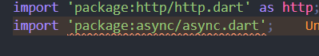

Langkah 2: Tambahkan variabel dan method
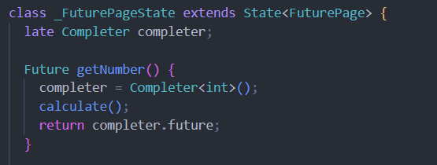

Langkah 3: Ganti isi kode onPressed()
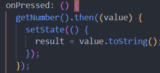

Langkah 4:

Jelaskan maksud kode langkah 2 tersebut!
Kode di atas menggunakan kelas Completer untuk mengendalikan penyelesaian sebuah Future secara manual.
Kode ini menggunakan Completer untuk menunda penyelesaian sebuah Future sampai perhitungan selesai dilakukan. Fungsi getNumber memulai calculate yang akan menunggu 5 detik sebelum menyelesaikan Future dengan nilai 42. Hal ini memungkinkan kontrol manual terhadap kapan Future tersebut selesai, memberikan fleksibilitas dalam penyelesaian proses asynchronous.

Langkah 5: Ganti method calculate()
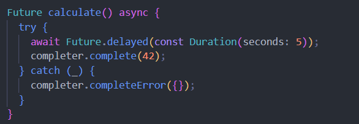

Langkah 6: Pindah ke onPressed()
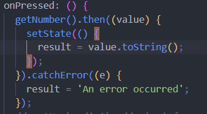

Jelaskan maksud perbedaan kode langkah 2 dengan langkah 5-6 tersebut!
Pada langkah 2, fungsi calculate() hanya menyelesaikan Future dengan mengembalikan nilai 42 setelah 5 detik, tanpa ada penanganan error. Sedangkan pada langkah 5, calculate() ditambahkan blok try-catch untuk menangani error. Jika error terjadi, completer.completeError({}) akan dipanggil untuk menandai Future sebagai gagal.

Kemudian di langkah 6, fungsi onPressed() diperbarui untuk menangani hasil Future dengan lebih fleksibel. Jika Future berhasil, hasilnya akan diproses dan ditampilkan menggunakan then(). Jika terjadi error, catchError() akan menangkapnya dan menampilkan pesan kesalahan, sehingga aplikasi dapat menampilkan respons yang sesuai tergantung pada keberhasilan atau kegagalan Future.

# Praktikum 4: Memanggil Future secara paralel

Langkah 1: Buka file main.dart
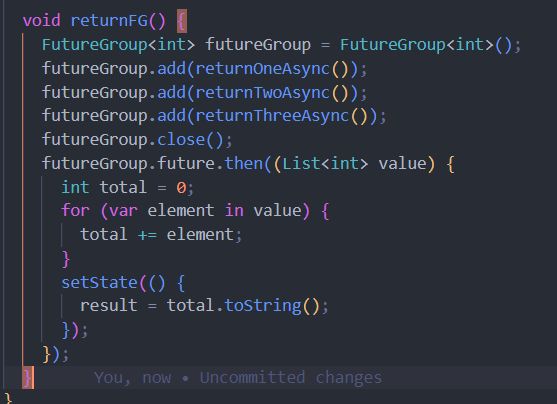

Langkah 2: Edit onPressed()
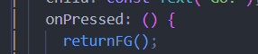

Langkah 3: Run
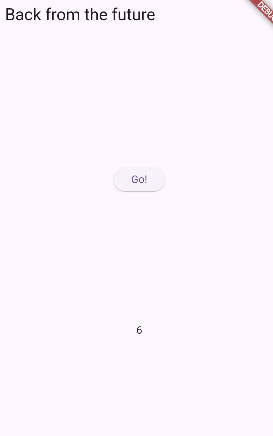

hasilnya dalam 3 detik berupa angka 6 lebih cepat dibandingkan praktikum sebelumnya menunggu sampai 9 detik.

Langkah 4: Ganti variabel futureGroup
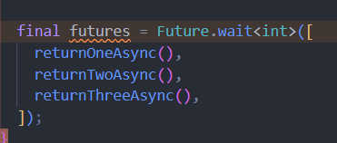

Jelaskan maksud perbedaan kode langkah 1 dan 4!
Pada langkah 1, kode memanfaatkan FutureGroup<int>, yang memungkinkan penambahan Future satu per satu sebelum menutup grup dengan futureGroup.close(). Setelah ditutup, grup akan menunggu semua Future di dalamnya selesai untuk menghitung totalnya.

Sedangkan di langkah 4, kode menggunakan Future.wait<int>(), yang lebih sederhana karena langsung menunggu semua Future dalam daftar (seperti returnOneAsync(), returnTwoAsync(), returnThreeAsync()) selesai secara bersamaan. Pendekatan ini tidak memerlukan penambahan Future secara manual atau pemanggilan .close().

