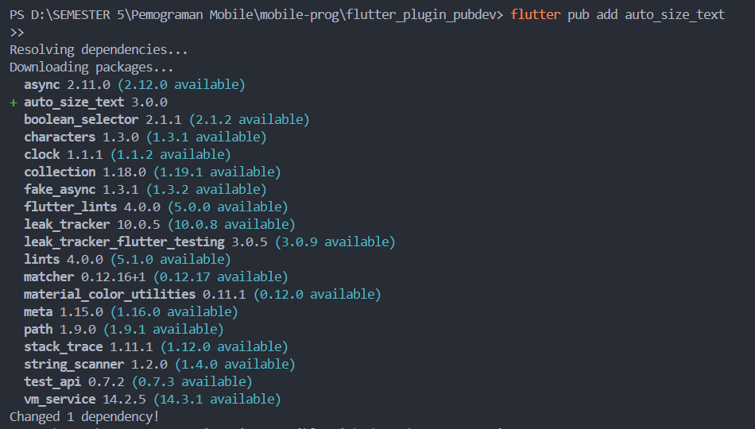
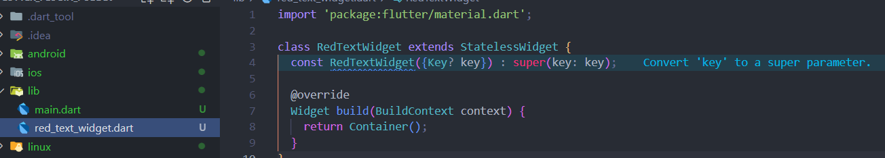
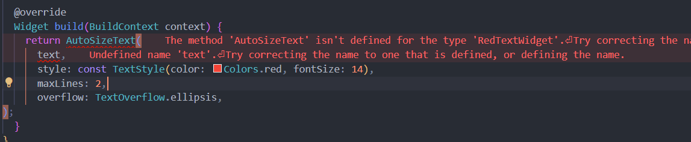
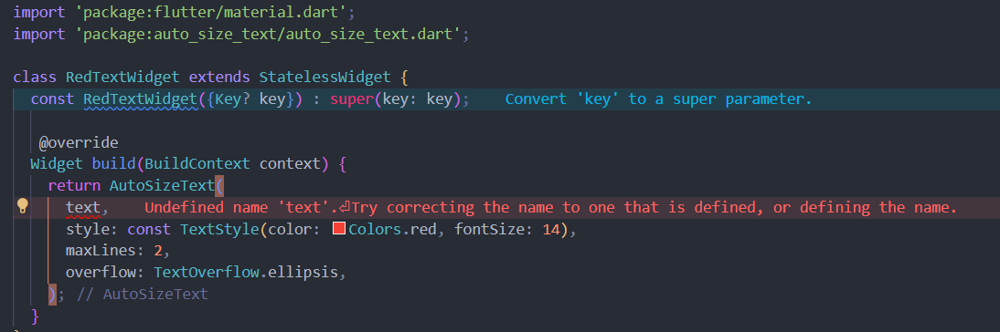
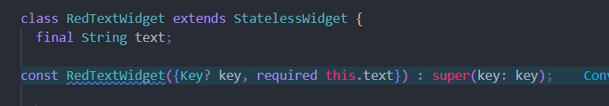
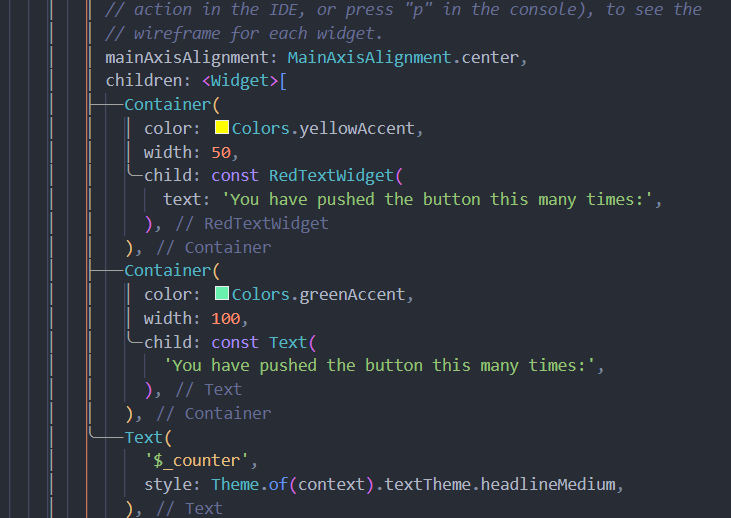
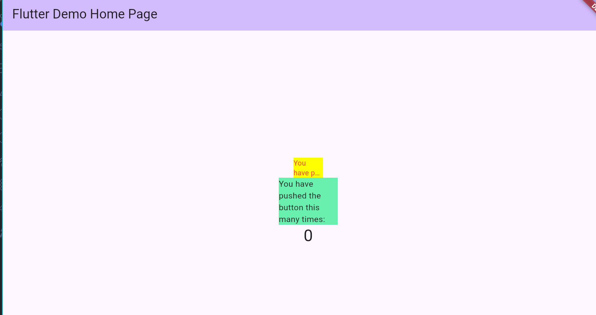

# Praktikum Menerapkan Plugin di Project Flutter

Langkah 1: Buat Project Baru
Langkah 2: Menambahkan Plugin

Langkah 3: Buat file red_text_widget.dart

Langkah 4: Tambah Widget AutoSizeText
mengubah kode return Container() menjadi seperti berikut

Ada erro karena belum import package

Langkah 5: Buat Variabel text dan parameter di constructor

Langkah 6: Tambahkan widget di main.dart

