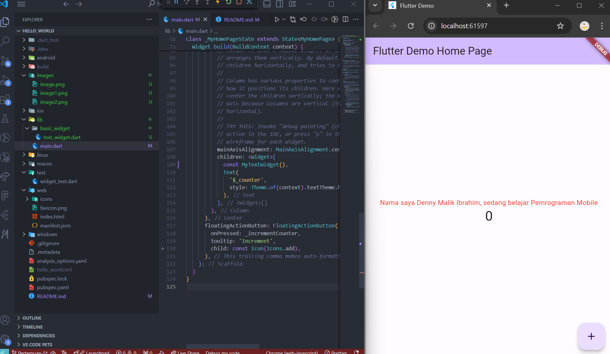
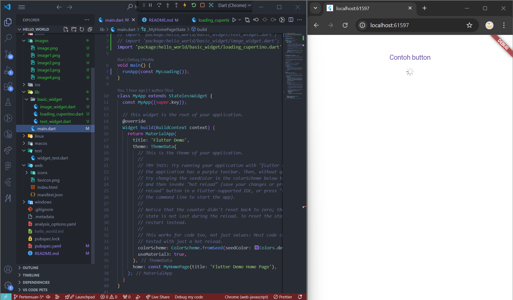

## Praktikum 1: Membuat Project Flutter Baru


## Praktikum 2: Menghubungkan Perangkat Android atau Emulator
Menggunakan chrome emulator untuk mencoba aplikasi yang sudah dibuat 


## Praktikum 3: Membuat Repository GitHub dan Laporan Praktikum


## Praktikum 4: Menerapkan Widget Dasar
Text_Widget


Image_Widget


## Praktikum 5: Menerapkan Widget Material Design dan iOS Cupertino
Langkah 1: Cupertino Button dan Loading Bar


Langkah 2: Floating Action Button (FAB)


Langkah 3: Scaffold Widget


Langkah 4: Dialog Widget


Langkah 5: Input dan Selection Widget


Langkah 6: Date and Time Pickers


## Tugas Praktikum
Pada praktikum 5 mulai dari Langkah 3 sampai 6, buatlah file widget tersendiri di folder basic_widgets, kemudian pada file main.dart cukup melakukan import widget sesuai masing-masing langkah tersebut!<br><br>


main.dart
```dart
import 'package:flutter/material.dart';
import 'package:hello_world/basic_widgets/date_time_pickers.dart';
import 'package:hello_world/basic_widgets/dialog_widget.dart';
import 'package:hello_world/basic_widgets/image_widget.dart';
import 'package:hello_world/basic_widgets/input_selection_widget.dart';
import 'package:hello_world/basic_widgets/scaffold_widget.dart';

void main() {
  runApp(const MyApp());
}

class MyApp extends StatelessWidget {
  const MyApp({super.key});

  @override
  Widget build(BuildContext context) {
    return MaterialApp(
      title: 'Flutter Demo',
      theme: ThemeData(
        colorScheme: ColorScheme.fromSeed(seedColor: Colors.deepPurple),
        useMaterial3: true,
      ),
      home: const MyHomePage(title: 'Flutter Demo Home Page'),
    );
  }
}

class TugasNo2 extends StatelessWidget {
  const TugasNo2({super.key});

  @override
  Widget build(BuildContext context) {
    return const MaterialApp(
      home: Row(
        children: [
          Expanded(child: MyScaffoldWidget()),
          Expanded(child: MyDialogWidget()),
          Expanded(child: MyInputSelectionWidget()),
          Expanded(child: MyDateTimePickers()),
        ],
      ),
    );
  }
}

class MyHomePage extends StatefulWidget {
  const MyHomePage({super.key, required this.title});
  final String title;

  @override
  State<MyHomePage> createState() => _MyHomePageState();
}

class _MyHomePageState extends State<MyHomePage> {
  int _counter = 0;

  void _incrementCounter() {
    setState(() {
      _counter++;
    });
  }

  @override
  Widget build(BuildContext context) {
    return Scaffold(
      appBar: AppBar(
        backgroundColor: Theme.of(context).colorScheme.inversePrimary,
        title: Text(widget.title),
      ),
      body: Center(
        child: Column(
          mainAxisAlignment: MainAxisAlignment.center,
          children: <Widget>[
            const MyImageWidget(),
            Text(
              '$_counter',
              style: Theme.of(context).textTheme.headlineMedium,
            ),
          ],
        ),
      ),
      floatingActionButton: FloatingActionButton(
        onPressed: _incrementCounter,
        tooltip: 'Increment',
        child: const Icon(Icons.add),
      ),
    );
  }
}
```

Selesaikan Codelabs: Your first Flutter app, lalu buatlah laporan praktikumnya dan push ke repository GitHub Anda!<Br>

Folder namer_app

<br>

