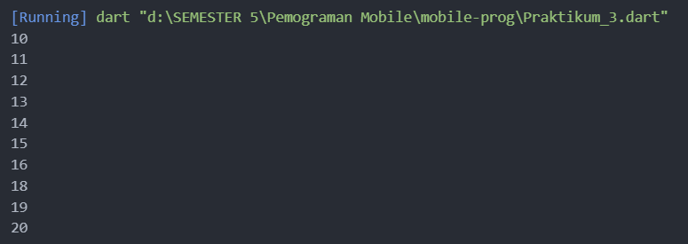
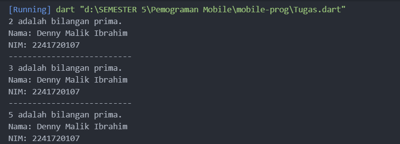
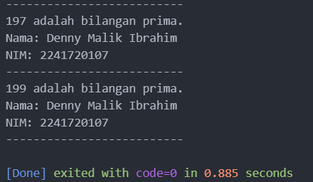

Praktikum 1!

Langkah 2:
Silakan coba eksekusi (Run) kode pada langkah 1 tersebut. Apa yang terjadi? Jelaskan!
Kesimpulannya kita harus memastikan bahwa kata kunci if dan else ditulis dengan huruf kecil sesuai aturan bahasa Dart.

Langkah 3:
Tambahkan kode program berikut, lalu coba eksekusi (Run) kode Anda.

String test = "true";
if (test) {
   print("Kebenaran");
}

Apa yang terjadi ? Jika terjadi error, silakan perbaiki namun tetap menggunakan if/else.
Nama 'test' sudah di definisikan sebelumnya, jadi tidak perlu di definisikan lagi.
Jadi harus mendefinisikan nama 'test' yang baru.

Praktikum 2!
Langkah 2:
Silakan coba eksekusi (Run) kode pada langkah 1 tersebut. Apa yang terjadi? Jelaskan! Lalu perbaiki jika terjadi error.
Karena penggunaan variabel counter tanpa mendeklarasikannya terlebih dahulu

Langkah 3:
Apa yang terjadi ? Jika terjadi error, silakan perbaiki namun tetap menggunakan do-while.
Mengeluarkan output angka 0-76

Praktikum 3!
Langkah 2:
Silakan coba eksekusi (Run) kode pada langkah 1 tersebut. Apa yang terjadi? Jelaskan! Lalu perbaiki jika terjadi error.
variabel index tidak didefinikan, dan nama variabel index tidak konsisten (tidak sama)

Langkah 3:
Apa yang terjadi ? Jika terjadi error, silakan perbaiki namun tetap menggunakan for dan break-continue.
Kesalahan nama 'Index', if tidak ditulis dengan huruf kecil, kesalahan titik koma, kesalahan penulisan else, dan kesalahan syarat di else if.

TUGAS!

