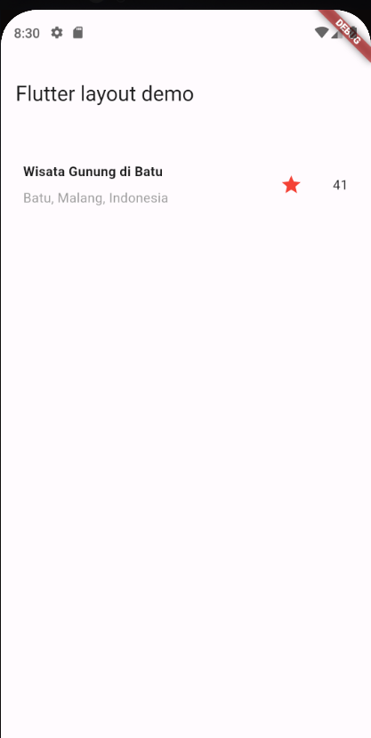
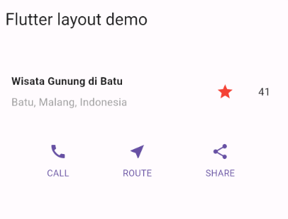
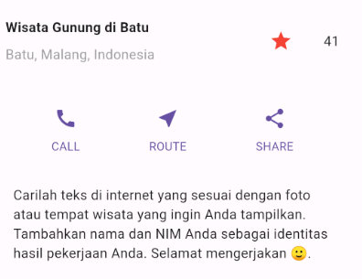
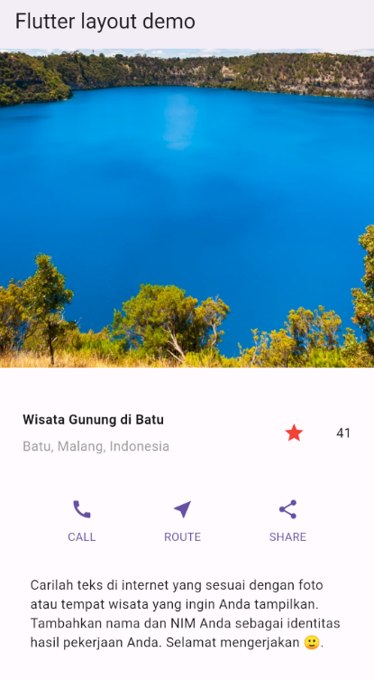

# 06 | Layout dan Navigasi

## Praktikum 1: Membangun Layout di Flutter

Class MyApp:

MyApp adalah class utama yang mengimplementasikan StatelessWidget, sehingga widget ini tidak berubah setelah dibuat. 
Di dalam metode build(), aplikasi membuat MaterialApp yang berfungsi sebagai kerangka dasar aplikasi Flutter. 
Di dalam MaterialApp, terdapat Scaffold yang menyediakan struktur layout dasar dengan AppBar (bar di bagian atas) dan body di bagian tengah. 
body diisi dengan Center yang berisi teks "Hello World".

Widget titleSection:

Ini adalah sebuah Container yang digunakan untuk membungkus baris (Row) dengan beberapa elemen di dalamnya. 
Pada baris pertama, ada sebuah Expanded widget yang memungkinkan kolom (Column) di dalamnya mengisi ruang kosong yang tersedia.

Column dalam Expanded:

Kolom ini diisi dengan beberapa widget: 
Container pertama berisi teks "Wisata Gunung di Batu" dengan TextStyle yang membuat teks menjadi tebal. 
Di bawahnya, ada teks "Batu, Malang, Indonesia" dengan gaya tertentu.

Ikon dan teks di Row:

Setelah Expanded, ada Icon (soal 3) yang ditampilkan di samping kolom, dengan warna dan jenis ikon yang perlu diisi. 
Diikuti dengan teks (soal 3) yang kemungkinan menampilkan rating atau informasi tambahan.

## Praktikum 2: Implementasi button row

Metode _buildButtonColumn:

Ini adalah metode privat yang digunakan untuk membuat sebuah kolom (Column) berisi ikon dan teks di bawahnya. 
Metode ini menerima tiga parameter: warna (Color), ikon (IconData), dan teks label (String). 
Di dalam kolom, ada ikon yang diwarnai menggunakan parameter color, dan teks yang berada di dalam Container dengan margin atas sebesar 8 pixel untuk memberi sedikit jarak dari ikon.

Penggunaan warna dari tema aplikasi:

Warna (Color) yang digunakan untuk ikon dan teks diambil dari tema aplikasi menggunakan Theme.of(context).primaryColor, sehingga warna yang digunakan dapat sesuai dengan tema yang ditentukan untuk aplikasi.

Widget buttonSection:

buttonSection adalah sebuah Row (baris horizontal) yang menempatkan tiga kolom di dalamnya dengan jarak yang merata antar elemen, karena menggunakan mainAxisAlignment: MainAxisAlignment.spaceEvenly.  
Setiap kolom dibuat menggunakan metode _buildButtonColumn, dengan ikon dan teks berbeda: CALL, ROUTE, dan SHARE, yang masing-masing diberi ikon Icons.call, Icons.near_me, dan Icons.share.

## Praktikum 3: Implementasi text section

Container:

Widget textSection menggunakan Container sebagai pembungkus utamanya. Container ini memberikan padding sebesar 32 pixel di seluruh sisi, sehingga teks di dalamnya tidak menempel langsung pada tepi layar.

Teks:

Di dalam Container, ada widget Text yang menampilkan beberapa baris teks.
Teks yang ditampilkan memberikan instruksi untuk mencari teks yang sesuai dengan gambar atau tempat wisata dan menyertakan nama serta NIM sebagai identitas.

Konfigurasi Teks:

softWrap: true memastikan teks akan secara otomatis terbungkus (wrap) ke baris berikutnya jika melebihi lebar layar, sehingga tidak akan terpotong atau keluar dari layar.

## Praktikum 4: Implementasi image section

Aset Gambar:

Pada bagian assets: di file pubspec.yaml, terdapat entri assets/image.png. Ini adalah cara untuk mendaftarkan aset gambar agar bisa digunakan di aplikasi Flutter. Flutter akan mencari gambar image.png di dalam folder assets/.

ListView:

Di dalam aplikasi, ListView digunakan sebagai widget yang bisa menampung banyak anak (children) dan memungkinkan mereka untuk di-scroll secara vertikal jika konten melebihi tinggi layar.

Image.asset:

Di dalam ListView, terdapat widget Image.asset yang digunakan untuk menampilkan gambar dari aset yang sudah terdaftar (assets/image.png). 
Gambar akan disesuaikan ukurannya menjadi lebar 600 pixel dan tinggi 400 pixel. 
fit: BoxFit.cover berarti gambar akan di-scale agar memenuhi seluruh area yang diberikan, dan bagian gambar yang mungkin tidak muat akan terpotong agar tetap mempertahankan proporsi aslinya.