# Praktikum 1: Dasar State dengan Model-View

Langkah 1: Buat Project Baru
Langkah 2: Membuat model task.dart

Langkah 3: Buat file plan.dart
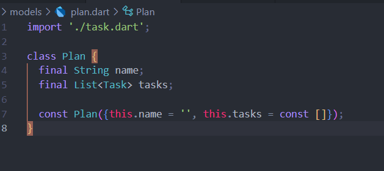

Langkah 4: Buat file data_layer.dart
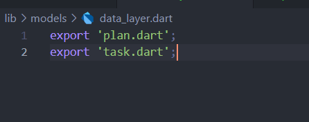

Langkah 5: Pindah ke file main.dart
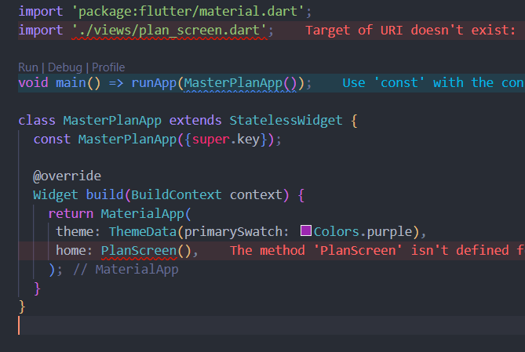

Langkah 6: buat plan_screen.dart
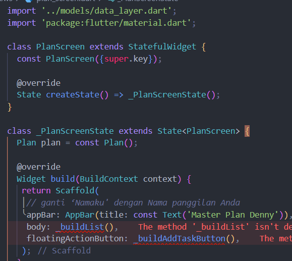

Langkah 7: buat method _buildAddTaskButton()
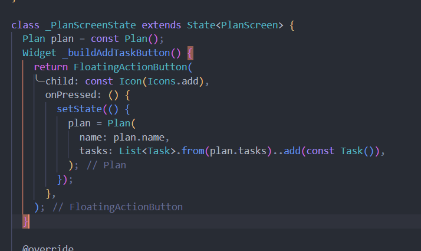

Langkah 8: buat widget _buildList()
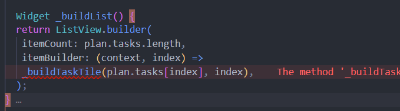

Langkah 9: buat widget _buildTaskTile
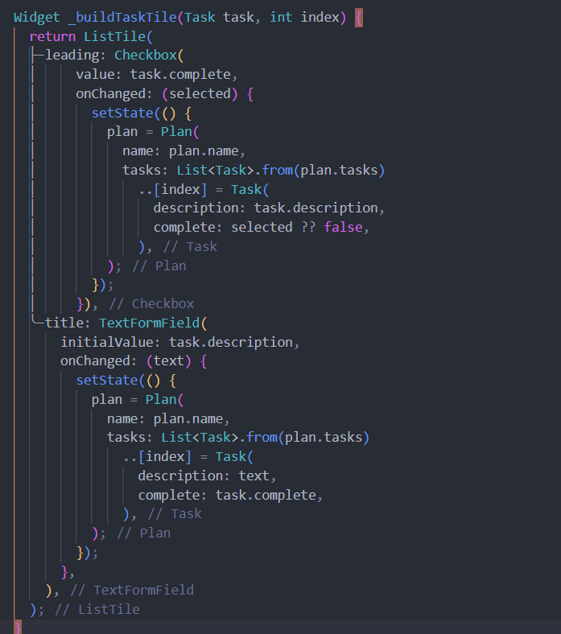

Langkah 10: Tambah Scroll Controller
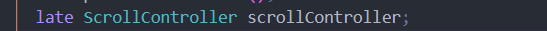

Langkah 11: Tambah Scroll Listener
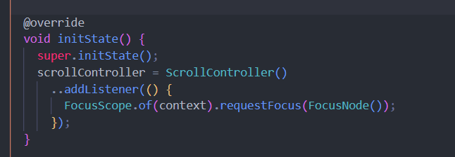

Langkah 12: Tambah controller dan keyboard behavior
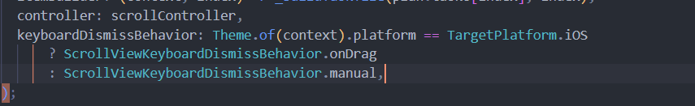

Langkah 13: Terakhir, tambah method dispose()
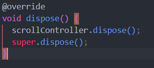

Langkah 14: Hasil
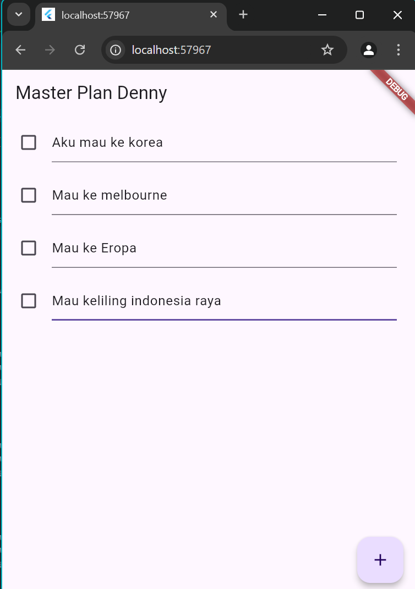

# Tugas Praktikum 1: Dasar State dengan Model-View
1. Selesaikan langkah-langkah praktikum tersebut, lalu dokumentasikan berupa GIF hasil akhir praktikum beserta penjelasannya di file README.md! Jika Anda menemukan ada yang error atau tidak berjalan dengan baik, silakan diperbaiki.

2. Jelaskan maksud dari langkah 4 pada praktikum tersebut! Mengapa dilakukan demikian?
Langkah 4 pada praktikum ini bertujuan untuk membuat file bernama data_layer.dart yang berfungsi sebagai "wrapper" atau pembungkus untuk beberapa file data layer lainnya, seperti plan.dart dan task.dart.

Dengan menambahkan perintah export untuk masing-masing file (plan.dart dan task.dart) di dalam data_layer.dart, kita menyederhanakan proses impor di tempat lain dalam aplikasi. Jadi, ketika komponen lain membutuhkan akses ke model plan dan task, kita cukup mengimpor data_layer.dart saja tanpa perlu mengimpor masing-masing file satu per satu.

3. Mengapa perlu variabel plan di langkah 6 pada praktikum tersebut? Mengapa dibuat konstanta ?
Variabel plan dideklarasikan agar kelas _PlanScreenState memiliki referensi ke objek Plan. Variabel ini akan menyimpan data atau status yang berkaitan dengan rencana tertentu (plan) yang mungkin digunakan dalam tampilan (UI) atau logika aplikasi.

Penggunaan const di sini untuk mendefinisikan Plan sebagai objek konstanta. Ini berarti objek tersebut tidak akan diubah setelah dibuat, sehingga cocok untuk nilai atau konfigurasi yang tetap (immutable) dan tidak berubah selama aplikasi berjalan. Pendekatan ini juga dapat meningkatkan efisiensi penggunaan memori, karena objek konstanta yang sama akan dipakai kembali di seluruh aplikasi alih-alih membuat objek baru setiap kali.

4. Lakukan capture hasil dari Langkah 9 berupa GIF, kemudian jelaskan apa yang telah Anda buat!

5. Apa kegunaan method pada Langkah 11 dan 13 dalam lifecyle state ?
Pada kode ini, initState dan dispose adalah bagian dari lifecycle widget di Flutter yang berfungsi untuk mengelola siklus hidup State pada widget.

Langkah 11: initState

initState: Dipanggil satu kali saat objek State pertama kali dibuat.
Pada kode ini, initState digunakan untuk:
Memanggil super.initState(), yang menjalankan inisialisasi pada kelas induk State.
Menginisialisasi scrollController, yang merupakan objek ScrollController untuk mengelola perilaku scrolling.
addListener: Menambahkan listener ke scrollController. Listener ini membuat fokus input berpindah saat pengguna menggulir (scroll) ke area lain, sehingga fokus pada elemen input seperti TextField dihapus.

Langkah 13: dispose
dispose: Dipanggil saat objek State akan dihancurkan dan tidak lagi digunakan.
Pada kode ini, dispose digunakan untuk:
Memanggil scrollController.dispose(), yang membersihkan scrollController dan melepaskan sumber daya yang terikat padanya. Ini penting untuk mencegah kebocoran memori karena ScrollController tidak lagi diperlukan setelah widget dihapus.
Memanggil super.dispose() untuk menjalankan pembersihan tambahan dari kelas induk State.

Jadi, kedua metode ini membantu mengelola inisialisasi dan pembersihan sumber daya yang digunakan oleh widget, menjaga efisiensi aplikasi dan mencegah kebocoran memori.

6. Kumpulkan laporan praktikum Anda berupa link commit atau repository GitHub ke dosen yang telah disepakati !

# Praktikum 2: Mengelola Data Layer dengan InheritedWidget dan InheritedNotifier

Langkah 1: Buat file plan_provider.dart
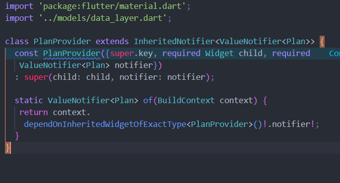

Langkah 2: Edit main.dart
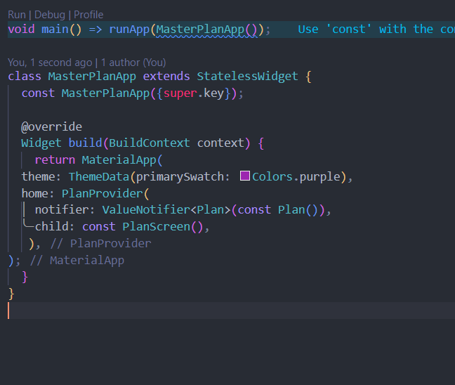

Langkah 3: Tambah method pada model plan.dart
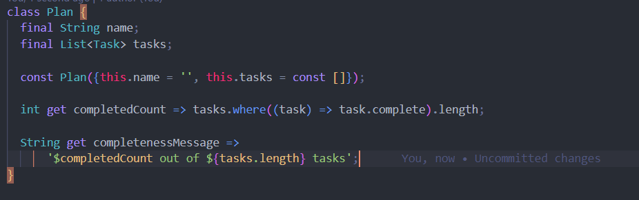

Langkah 4: Pindah ke PlanScreen
Langkah 5: Edit method _buildAddTaskButton
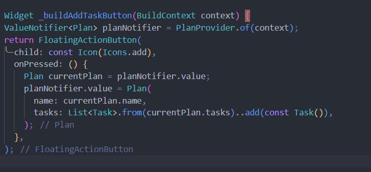

Langkah 6: Edit method _buildTaskTile
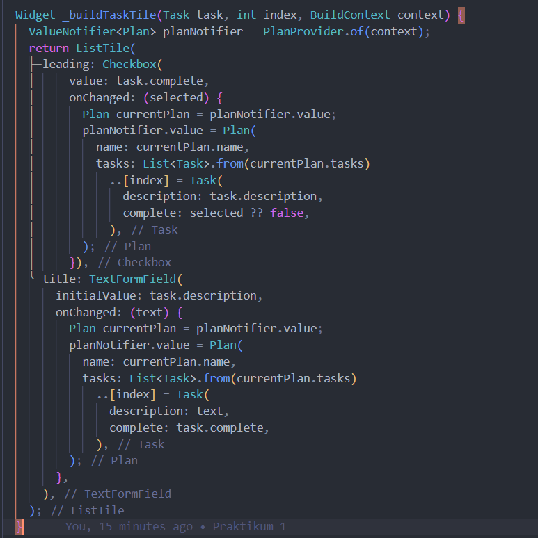

Langkah 7: Edit _buildList
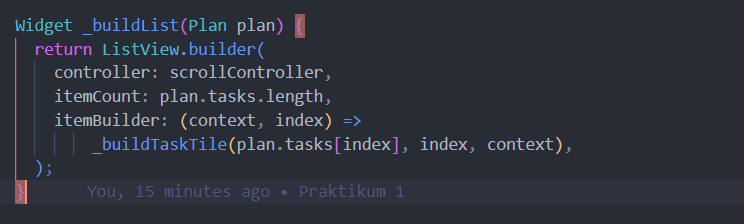

Langkah 8: Tetap di class PlanScreen
Langkah 9: Tambah widget SafeArea
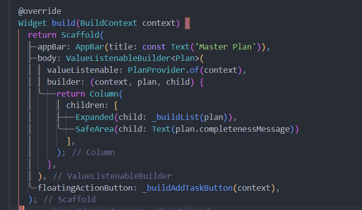

# Tugas Praktikum 2: InheritedWidget
1. Selesaikan langkah-langkah praktikum tersebut, lalu dokumentasikan berupa GIF hasil akhir praktikum beserta penjelasannya di file README.md! Jika Anda menemukan ada yang error atau tidak berjalan dengan baik, silakan diperbaiki sesuai dengan tujuan aplikasi tersebut dibuat.
 
2. Jelaskan mana yang dimaksud InheritedWidget pada langkah 1 tersebut! Mengapa yang digunakan InheritedNotifier?
InheritedWidget di Flutter adalah jenis widget khusus yang memungkinkan widget lain dalam tree widget untuk berbagi data tanpa perlu mengirimkan data itu secara eksplisit melalui konstruktor. InheritedWidget sangat berguna dalam keadaan di mana banyak widget memerlukan akses ke data yang sama dan perubahan pada data tersebut memicu pembaruan UI.

Jadi, InheritedNotifier dipilih pada langkah 1 karena memberikan pengaturan data dan state yang lebih efisien dan responsif terhadap perubahan, dibandingkan dengan InheritedWidget yang standar.

3. Jelaskan maksud dari method di langkah 3 pada praktikum tersebut! Mengapa dilakukan demikian?
Pada langkah 3, terdapat dua metode getter yang digunakan untuk menghitung jumlah tugas yang telah selesai dan membuat pesan yang menggambarkan sejauh mana tugas tersebut selesai

completedCount
Menggunakan getter ini memungkinkan kita untuk menghitung jumlah tugas yang selesai dengan cara yang deklaratif dan efisien.
Pendekatan ini menghindari kita untuk menyimpan nilai yang dihitung secara terpisah, sehingga mengurangi kemungkinan inkonsistensi data.

completenessMessage
Getter ini digunakan untuk menghasilkan pesan yang dinamis berdasarkan jumlah tugas yang telah selesai dan jumlah total tugas.
Menggunakan getter di sini memungkinkan tampilan yang mudah diperbarui, karena nilai pesan ini secara otomatis diperbarui setiap kali completedCount atau tasks.length berubah.

4. Lakukan capture hasil dari Langkah 9 berupa GIF, kemudian jelaskan apa yang telah Anda buat!
5. Kumpulkan laporan praktikum Anda berupa link commit atau repository GitHub ke dosen yang telah disepakati !

# Praktikum 3: Membuat State di Multiple Screens
Langkah 1: Edit PlanProvider
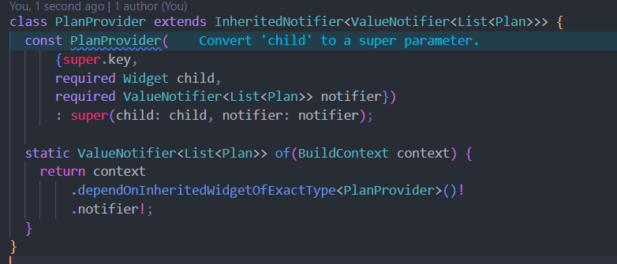

Langkah 2: Edit main.dart
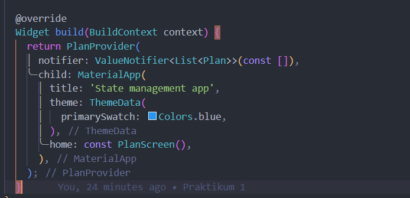

Langkah 3: Edit plan_screen.dart
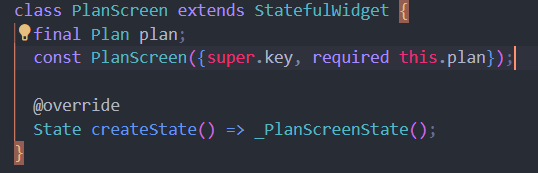

Langkah 4: Error
Langkah 5: Tambah getter Plan
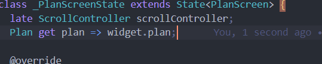

Langkah 6: Method initState()
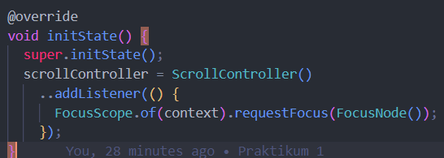

Langkah 7: Widget build
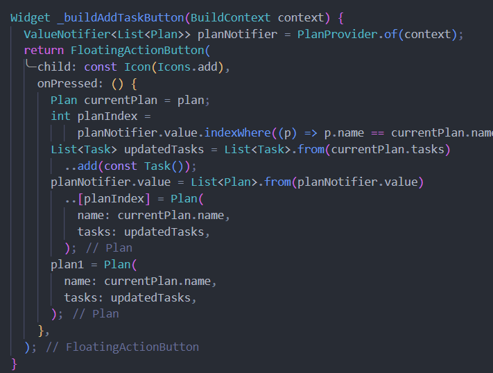
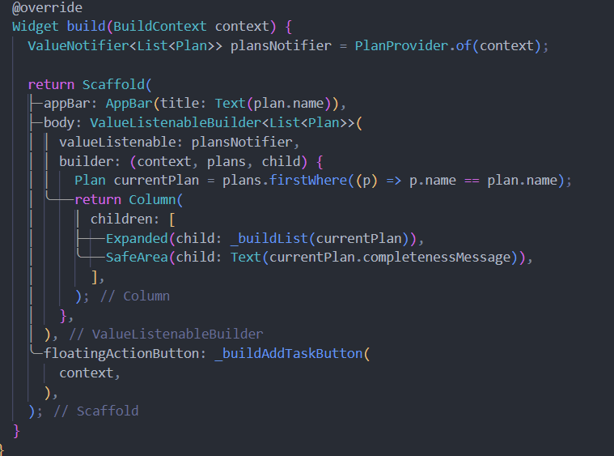

Langkah 8: Edit _buildTaskTile
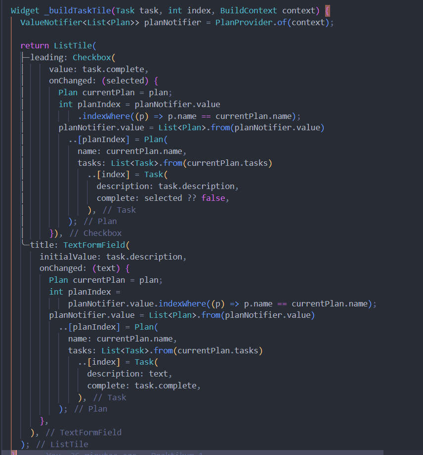

Langkah 9: Buat screen baru
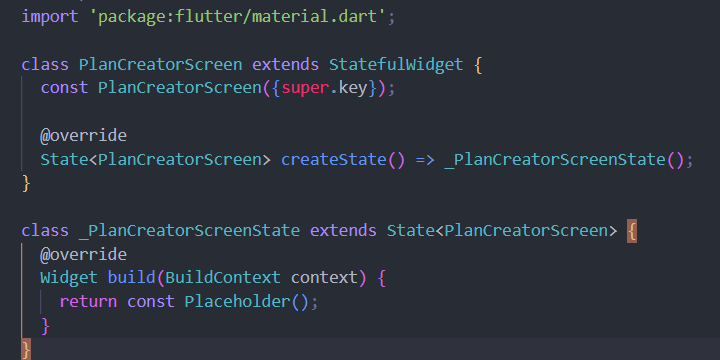
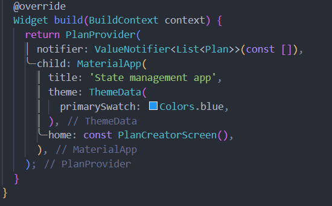

Langkah 10: Pindah ke class _PlanCreatorScreenState
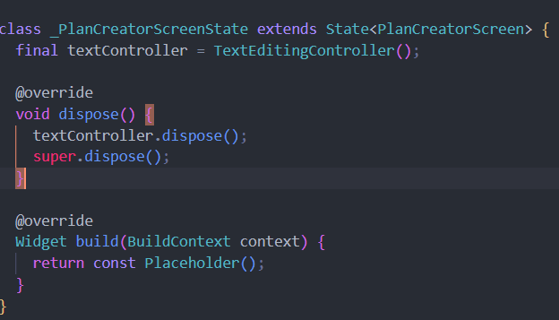

Langkah 11: Pindah ke method build
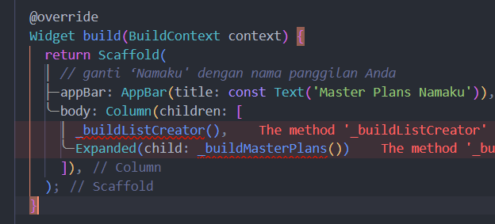

Langkah 12: Buat widget _buildListCreator
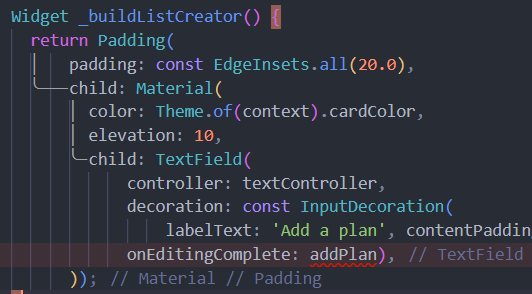

Langkah 13: Buat void addPlan()
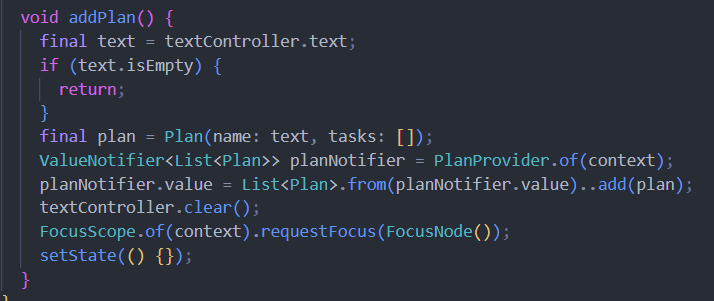

Langkah 14: Buat widget _buildMasterPlans()

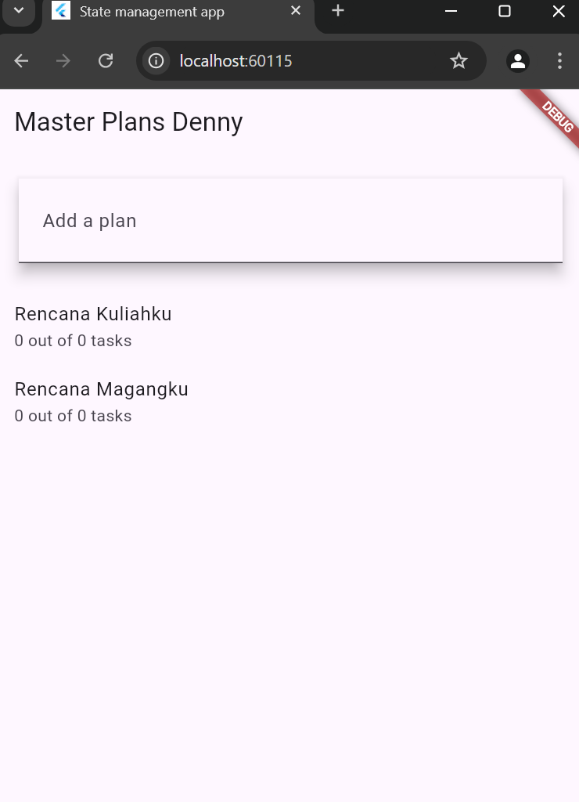

