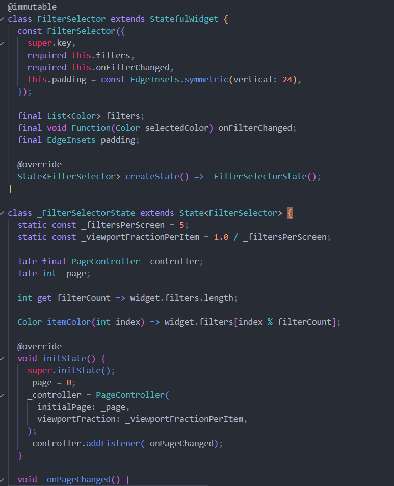
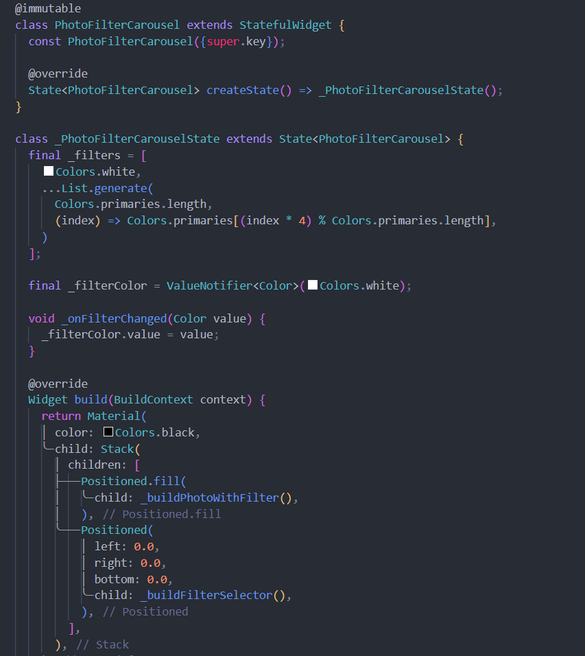
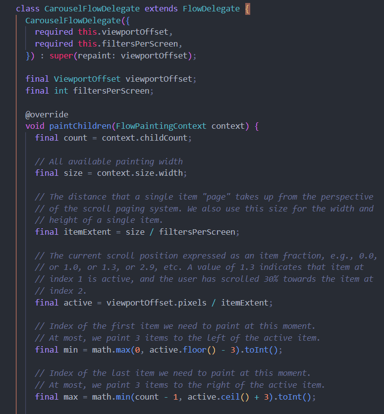
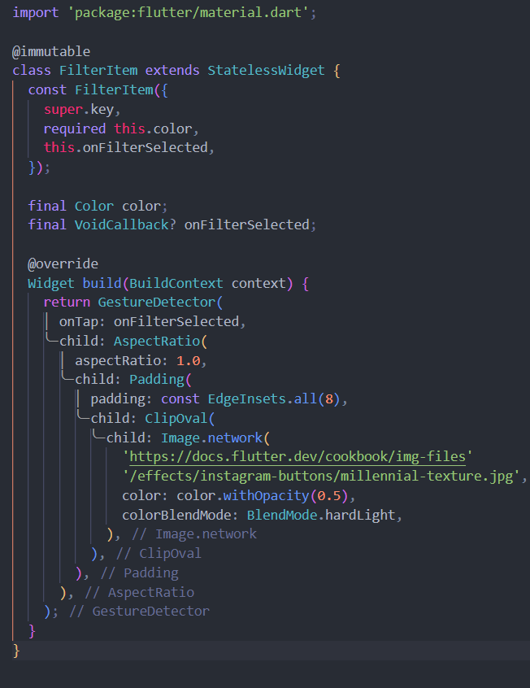
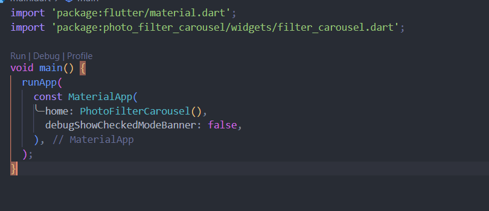

# Praktikum 2: Membuat photo filter carousel

Langkah 1: Buat project baru
Langkah 2: Buat widget Selector ring dan dark gradient

Langkah 3: Buat widget photo filter carousel

Langkah 4: Membuat filter warna - bagian 1

Langkah 5: Membuat filter warna

Langkah 6: Implementasi filter carousel

# Tugas Praktikum

1. Selesaikan Praktikum 1 dan 2, lalu dokumentasikan dan push ke repository Anda berupa screenshot setiap hasil pekerjaan beserta penjelasannya di file README.md! Jika terdapat error atau kode yang tidak dapat berjalan, silakan Anda perbaiki sesuai tujuan aplikasi dibuat!

2. Gabungkan hasil praktikum 1 dengan hasil praktikum 2 sehingga setelah melakukan pengambilan foto, dapat dibuat filter carouselnya!

3. Jelaskan maksud void async pada praktikum 1?
Dalam kode Future main() async { ... }, Future menunjukkan bahwa fungsi main adalah fungsi asinkron yang menghasilkan sebuah objek Future tanpa nilai pengembalian (void). Kata kunci async menandakan fungsi ini sebagai asinkron, memungkinkan penggunaan kata kunci await di dalamnya untuk menunggu penyelesaian operasi asinkron lainnya tanpa menghentikan jalannya program. Dengan kombinasi ini, fungsi main bisa melakukan operasi asinkron secara efisien dan menjaga responsivitas program.

4. Jelaskan fungsi dari anotasi @immutable dan @override ?
Dalam kode Future main() async { ... }, Future menunjukkan bahwa fungsi main adalah fungsi asinkron yang menghasilkan sebuah objek Future tanpa nilai pengembalian (void). Kata kunci async menandakan fungsi ini sebagai asinkron, memungkinkan penggunaan kata kunci await di dalamnya untuk menunggu penyelesaian operasi asinkron lainnya tanpa menghentikan jalannya program. Dengan kombinasi ini, fungsi main bisa melakukan operasi asinkron secara efisien dan menjaga responsivitas program.

5. Kumpulkan link commit repository GitHub Anda kepada dosen yang telah disepakati!